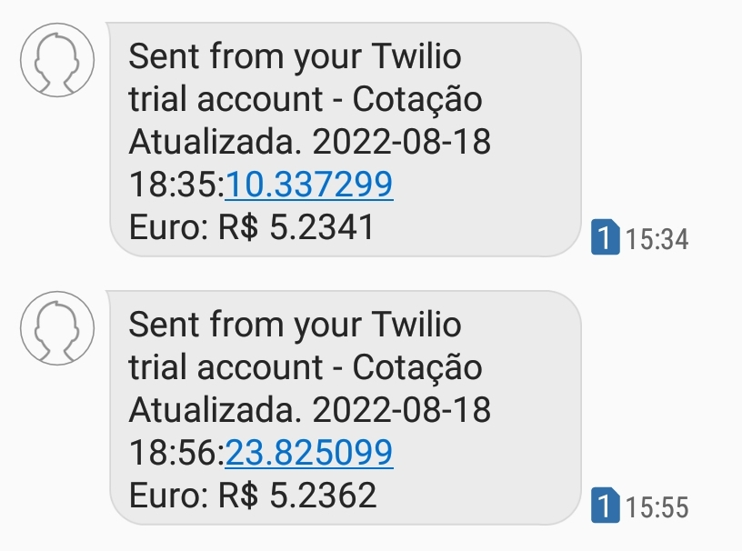

# Português
## As vezes trabalho como freelancer de um site internacional que paga em Euro e eu senti uma necessidade de saber a cotação do Euro todo dia para saber o melhor dia para eu converter. Então automatizei o processo com 2 API's, uma de cotação de moedas e uma de envio de SMS.

## Eu recebi a cotação do Euro em JSON, converti para dicionários Python.
## Peguei o valor do Euro atualizado e coloquei no corpo da mensagem do SMS.
## Enviei o SMS para meu celular.
## Coloquei a API em um servidor, Heroku, e recebo um SMS com a cotação atualizada do Euro toda manhã como programei no servidor.

# English
## Sometimes I work as a freelancer for an international website that pays in Euros and I felt the need to know the Euro rate every day to know the best day for me to convert. So I automated the process with 2 APIs, one for quoting currencies and one for sending SMS.
## I received the Euro quote in JSON, converted it to Python dictionaries.
## I took the updated Euro value and placed it in the body of the SMS message.
## I sent the SMS to my phone.
## I placed the API on a server, Heroku, and I receive an SMS with the updated Euro rate every morning as I programmed it on the server.

